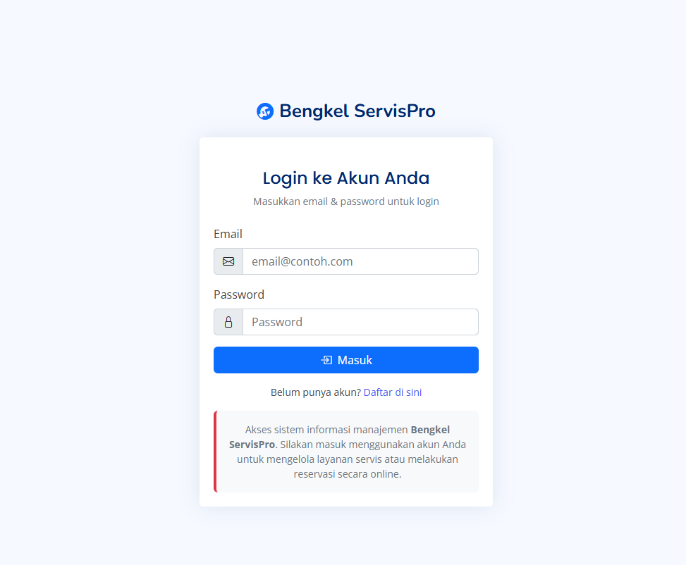
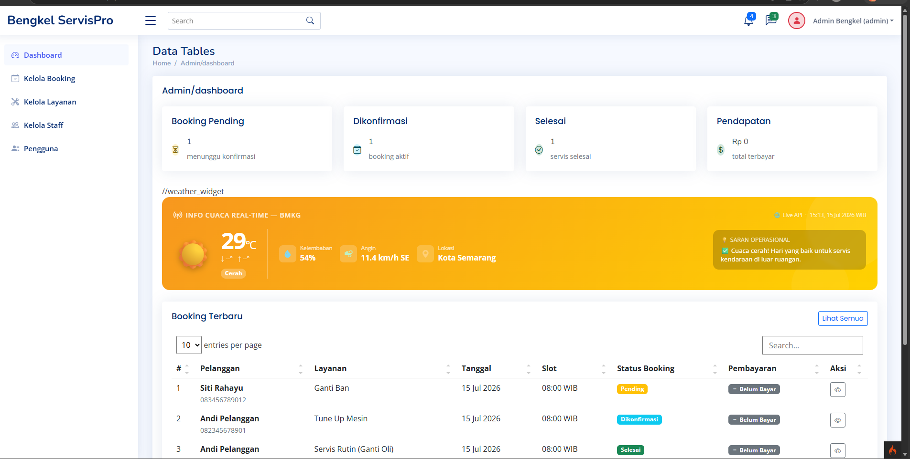
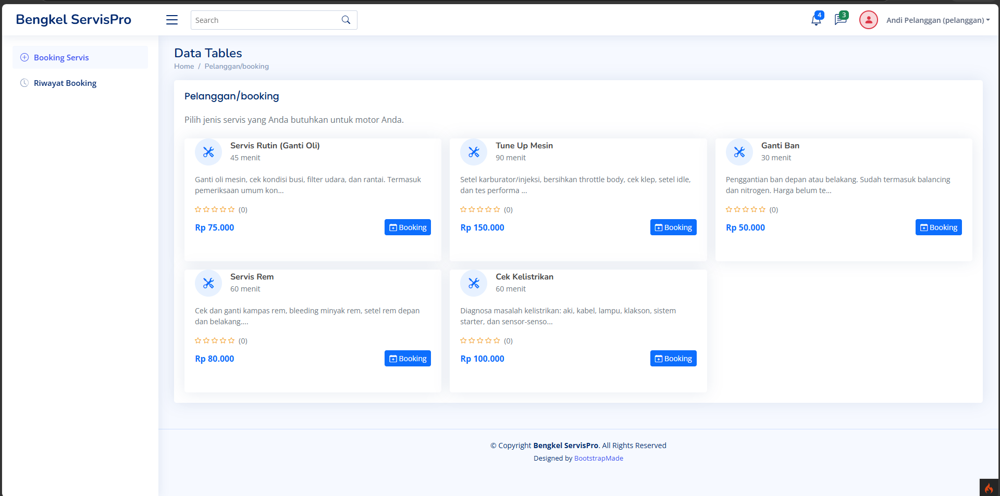
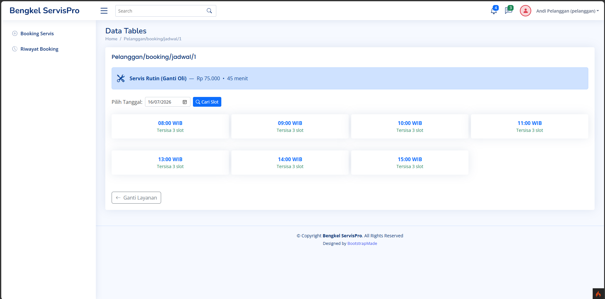
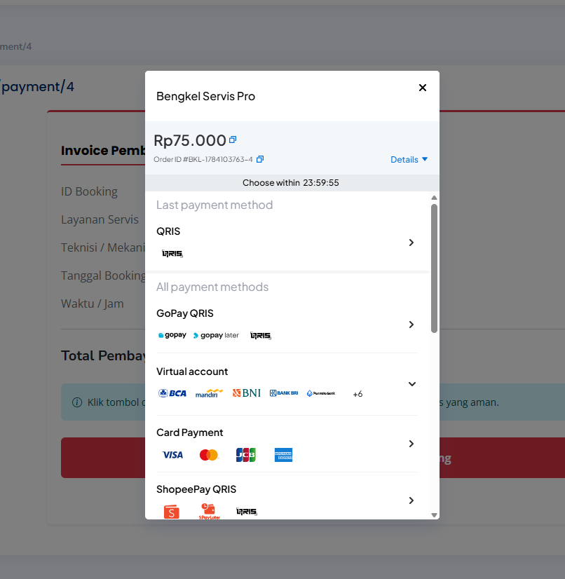

# Bengkel ServisPro — Sistem Booking Layanan Motor

Project Akhir Pemrograman Web Lanjut — CodeIgniter 4  
Universitas Dian Nuswantoro

---

## Tech Stack

- **Framework**: CodeIgniter 4
- **Database**: MySQL
- **Frontend**: Bootstrap 5 + Bootstrap Icons
- **Payment Gateway**: Midtrans (Native Snap API & Webhook)
- **Notification**: CI4 Native Email (SMTP)
- **External API**: BMKG Weather API

---

## Cara Instalasi

### 1. Clone / ekstrak project ke folder htdocs
```bash
git clone https://github.com/SahdaniArrya/Bengkel-ServisProFinal.git
cd Bengkel-ServisProFinal
```

### 2. Install dependencies
```bash
composer install
```

### 3. Konfigurasi .env
```bash
cp .env.example .env
```

Edit file `.env` dan sesuaikan pengaturan database, Midtrans, dan SMTP Email Anda. (Detail konfigurasi ada di komentar file `.env`).

### 4. Buat database
Buat database di MySQL/MariaDB (misal: `bengkel_uts_db`).

### 5. Jalankan migration & seeder
Pastikan database sudah terhubung dengan benar di `.env`.
```bash
php spark migrate
php spark db:seed DatabaseSeeder
```

### 6. Buat folder upload
```bash
mkdir -p public/uploads/services
```

### 7. Jalankan server lokal
```bash
php spark serve
```
Akses di: **http://localhost:8080**

---

## Akun Demo

| Role      | Email                    | Password  |
|-----------|--------------------------|-----------|
| Admin     | admin@bengkel.com        | admin123  |
| Staff     | staff@bengkel.com        | staff123  |
| Pelanggan | pelanggan@gmail.com      | user123   |

---

## Fitur yang Telah Diimplementasi

1. **Perencanaan & Desain Database**: ERD lengkap (3NF), 7 tabel terelasi (users, services, staff, schedules, bookings, payments, reviews).
2. **Migration & Seeder**: File migration dan seeder realistis untuk semua tabel (dapat di-rollback).
3. **Autentikasi & Otorisasi**: Login, logout, registrasi dengan proteksi Multi-Role (Admin, Staff, Pelanggan) menggunakan CI4 Filters.
4. **Fitur CRUD Utama**: Kelola Layanan, Jadwal, Booking (dengan validasi, flash message, dan upload foto).
5. **Integrasi Webservice Client**: Memanggil API Cuaca BMKG secara real-time.
6. **Webservice Server (REST API)**: Menyediakan endpoint API dengan autentikasi `X-API-KEY`.
7. **Payment Gateway**: Integrasi pembayaran Midtrans Sandbox menggunakan native CURL.
8. **Email Notifikasi**: Notifikasi SMTP otomatis saat booking dibuat dan saat pembayaran sukses/lunas.
9. **UI/UX**: Desain antarmuka profesional menggunakan Bootstrap 5 yang responsif dan konsisten.

---

## Dokumentasi API (Webservice Server)

Semua request ke API membutuhkan header:
`X-API-KEY: BENGKEL-SECRET-KEY-2024`

| Method | Endpoint | Deskripsi | Parameter/Body |
|--------|----------|-----------|----------------|
| GET | `/api/services` | Mendapatkan semua layanan aktif | - |
| GET | `/api/services/{id}` | Detail layanan tertentu | - |
| GET | `/api/bookings/{id}` | Detail booking tertentu | - |
| POST | `/api/bookings` | Membuat booking baru | `{"user_id": 1, "service_id": 1, "schedule_id": 1, "notes": ""}` |
| GET | `/api-docs` | Dokumentasi API lengkap (JSON) | - |

---

## Screenshot Aplikasi

### Halaman Login


### Dashboard Admin


### Daftar Layanan


### Form Booking


### Payment Midtrans

